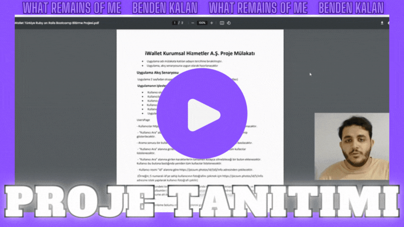
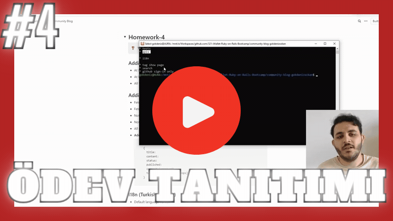
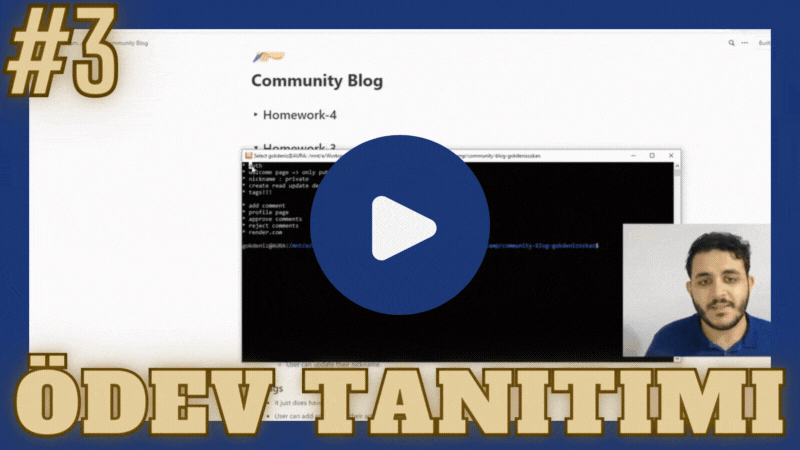
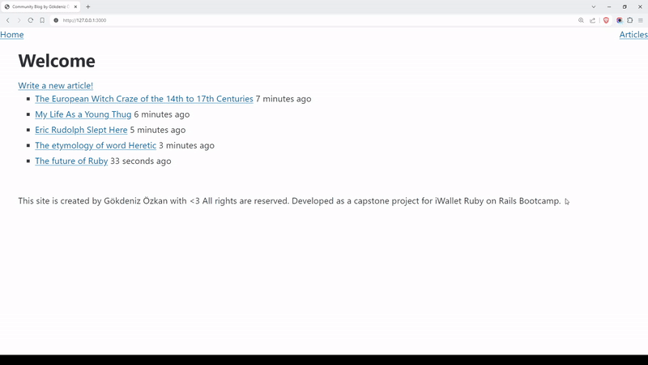
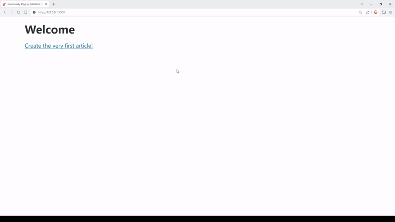

# What Remains of Me

An API Consumer Web App built with Ruby on Rails & Bulma CSS.

^ A quick look to all criteria asked in the Capstone Project, watch here: [https://youtu.be/5PRXHDwGe-0](https://youtu.be/5PRXHDwGe-0)

If you are short on time, check the 4 minutes long Loom video: [https://loom.com/share/79b272c...](https://www.loom.com/share/79b272c70b524fc2ac1610d340a7bdcb?sid=5a330c59-059f-4701-a0be-1df213a9296a)

## Quickstart

1. Clone the repo.
2. If first time running, run `bundle install; rails db:create db:migrate;` at project root.
3. To populate database, run `rake wrom_app:import_users` at project root.
4. Start server by running `rails server`.

## See what I have done throughout the bootcamp

### Medium article

I wrote a Medium article on Git and how it works. Find it here: https://blog.gokdenizozkan.com/understand-git-from-core-concepts-to-advanced-commands-c2237771d488?source=friends_link&sk=3743976143260371b65e3ebf97587a81

### Community Blog

I developed Community Blog as we were asked. Check it out here: https://github.com/321-iWallet-Ruby-on-Rails-Bootcamp/community-blog-gokdenizozkan

Also see how I done and presented them:

^ A quick look to all criteria asked in Homework #4, watch here: [https://youtu.be/62A_EPFW33k](https://youtu.be/62A_EPFW33k)

3rd Homework:  
  
  
  
2nd Homework:  

  
1st Homework:  

